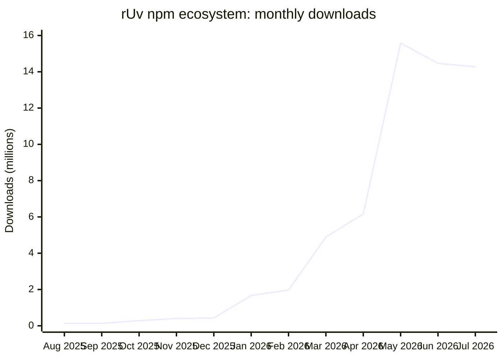

# rUv · Open source AI systems

**rUv** ([`ruvnet`](https://github.com/ruvnet)) builds open source infrastructure for agent orchestration, adaptive memory, vector intelligence, portable runtimes, and privacy preserving spatial sensing. The core stack is [RuView](https://github.com/ruvnet/RuView), [Ruflo](https://github.com/ruvnet/ruflo), [RuVector](https://github.com/ruvnet/RuVector), [MetaHarness](https://github.com/ruvnet/metaharness), [RVF](https://www.npmjs.com/package/@ruvector/rvf), and [RVM](https://github.com/ruvnet/rvm).

> **August 2026:** RuView and Ruflo remain the two distribution anchors, while WiFi Veil, rvQR, RuCelium, and RVForge extend the sensing and portable execution stack.

This ecosystem is published through one developer account. Repositories can include community contributions, automation, generated artifacts, and imported history. The evidence files keep those categories separate.

[Core stack](#how-the-stack-fits-together) · [August update](#august-2026-update) · [Recent projects](#recent-public-source-delta) · [Package index](docs/ruvnet-packages.md) · [Provenance dossier](docs/ruvnet-prior-art.md) · [Machine readable metrics](data/metrics.json) · [Citation](CITATION.cff)

<!-- github-public-metrics:start -->
## GitHub reach

Public GitHub API snapshot verified **August 10, 2026**.

| Measure | Verified value |
| --- | ---: |
| Followers | 10,880 |
| Public repositories | 200 |
| Owned public nonfork repositories | 176 |
| Public repositories that are forks | 24 |
| Stars across owned public nonfork repositories | 172,270 |
| Aggregate downstream forks of owned nonfork repositories | 23,339 |

### Flagship repository traction

| Project | Stars | Forks | Watchers | Purpose |
| --- | ---: | ---: | ---: | --- |
| [RuView](https://github.com/ruvnet/RuView) | 89,184 | 11,873 | 793 | Camera free WiFi spatial intelligence, presence, pose, and vital signal research |
| [Ruflo](https://github.com/ruvnet/ruflo) | 67,549 | 8,084 | 433 | Agent orchestration, swarms, routing, memory, and self learning workflows |
| [RuVector](https://github.com/ruvnet/RuVector) | 4,411 | 581 | 33 | Real time vector, graph, temporal, and adaptive memory infrastructure |
| [MetaHarness](https://github.com/ruvnet/metaharness) | 565 | 68 | 1 | Portable agent harness generation, evaluation, and bounded evolution across ten hosts |
| [RVM](https://github.com/ruvnet/rvm) | 134 | 27 | 0 | Capability controlled execution infrastructure for agentic systems |

The two flagships account for **91.0% of owned public nonfork portfolio stars** and **85.5% of aggregate downstream forks**. That concentration is both the strongest distribution wedge and the main portfolio dependency.
<!-- github-public-metrics:end -->

### Change since July 11

| Measure | July 11 | August 10 | Change |
| --- | ---: | ---: | ---: |
| RuView stars | 80,073 | 89,184 | 11.4% |
| Ruflo stars | 64,041 | 67,549 | 5.5% |
| RuVector stars | 4,348 | 4,411 | 1.4% |
| MetaHarness stars | 462 | 565 | 22.3% |
| Rust crates | 360 | 398 | 10.6% |
| Cumulative Rust crate downloads | 1,035,464 | 1,267,973 | 22.5% |
| Known npm packages, minimum | 361 | 370 | 2.5% |
| Public repositories | 197 | 200 | 1.5% |

## Traffic and audience

| Signal | Ruflo | RuView | Combined |
| --- | ---: | ---: | ---: |
| Git clone events, rolling 14 days | 88,567 | 27,989 | 116,556 |
| Average clone events per day | 6,326 | 1,999 | 8,325 |

These are owner reported figures supplied August 10, 2026 for GitHub's rolling 14 day traffic window. No unique cloner counts were supplied, and the owner only endpoint is not publicly reproducible. They are clone events, not unique people, so this profile does not convert clones or package downloads into a monthly active user claim.

Directly observable audience and activity signals:

| Measure | Value | Window |
| --- | ---: | --- |
| GitHub followers | 10,880 | August 10 snapshot |
| Contributions visible on the public GitHub profile | 15,019 | Trailing 365 days as of 12:46 UTC August 10; August 10 partial |
| Contributions visible on the public GitHub profile | 11,845 | January 1 through 12:46 UTC August 10; August 10 partial |
| Contributions visible on the public GitHub profile | 223 | August 1 through 12:46 UTC August 10; August 10 partial |
| GitHub public commit search matches for author `ruvnet` | 121 | August 1 through 12:46 UTC August 10; August 10 partial |
| Owned public repositories with pushes | 18 | August 1 through 12:46 UTC August 10; August 10 partial |
| New owned public repositories | 3 | August 1 through 12:46 UTC August 10; August 10 partial |

GitHub contribution totals can include commits, pull requests, issues, reviews, and anonymized private activity when that profile setting is enabled. They are not a commit count.

<!-- package-public-metrics:start -->
## Package distribution

| Measure | Verified value |
| --- | ---: |
| Published registry and Hugging Face artifacts | at least 798 |
| Known npm packages listing `ruvnet` as maintainer | at least 370 |
| npm search indexed packages | 369 |
| npm download events across the known set, rolling 365 days, 2025-08-10 through 2026-08-09 | at least 64,199,849 |
| Rust crates owned by `ruvnet` | 398 |
| Cumulative Rust crate downloads | 1,267,973 |
| Ownership verified PyPI packages | 8 |
| Hugging Face models, spaces, and datasets | 22 |

The npm and crates.io snapshot was assembled at **2026-08-10T13:21:28Z** from official APIs. The npm minimum includes one verified package omitted from maintainer search.

The known npm catalog sustained **14.3 million to 15.6 million monthly downloads** from May through July 2026. Those three months produced **44,320,351 downloads**, equal to **69.0%** of the rolling year minimum.
<!-- package-public-metrics:end -->

July closed at **14,274,377 downloads**, 1.3% below June and 108.1 times August 2025. Because the package inventory expanded during the period, this is a portfolio distribution trend rather than same cohort user growth.

<!-- registry-download-chart:start -->
## npm download growth

Monthly download events across at least 370 known npm packages listing ruvnet as a maintainer. The chart uses the latest 12 complete UTC calendar months; figures are millions of package downloads.

**Period:** 2025-08-01 through 2026-07-31 · **Source:** official npm daily range API · Scoped, unscoped, and target specific platform packages included. Download events are not unique users.
<!-- registry-download-chart:end -->

## August 2026 update

| Project or release | Shipped | What it adds |
| --- | --- | --- |
| [RuField component set](https://github.com/ruvnet/rufield) | July 14 | Five Rust crates for field observations, provenance, privacy, fusion, and WiFi DensePose integration |
| [RuVector adaptive ANN expansion](https://github.com/ruvnet/RuVector) | July 27 | Six Rust crates for speculative and adaptive ANN, diverse beams, bounded RAG, and recall bounded search |
| [RuView RF and HOMECORE expansion](https://github.com/ruvnet/RuView) | July 31 | Eight RF, NVSIM, point cloud, occupancy world, and desktop crates plus nine HOMECORE home automation crates |
| [WiFi Veil](https://github.com/ruvnet/wifi-veil) | August 9 | Standards oriented privacy research using keyed waveform transformations; current evidence is synthetic L0 and does not establish radio or regulatory compliance |
| [RVForge](https://www.npmjs.com/package/@ruvector/rvforge) | August 4, v0.2.0 August 5 | Creates and validates canonical RVF containers, then stages deterministic target bundles with inventory, checksums, provenance, and receipts; native installer generation still requires the pending Tauri packaging layer; [source](https://github.com/ruvnet/RuVector/tree/main/npm/packages/rvforge) |
| [rvQR](https://github.com/ruvnet/rvQR) | August 2 | Alpha optical transfer of RVF containers and WASM artifacts through animated QR codes; SHA 256 verifies integrity, while signed sender manifests remain roadmap work |
| [RuCelium](https://github.com/ruvnet/RuCelium) | August 2 | Federated environmental intelligence reference stack extending RuField, distributed as eight currently published Rust components plus `rucelium-harness`; current benchmarks are synthetic and current real input is unlabeled CSI file replay |
| [MetaHarness 0.4.4](https://www.npmjs.com/package/metaharness) | August 9 | Portable harness generation across ten hosts, plus new Radio, Horizon, OO Agents, and Prime Agent packages |
| [Darwin 0.8.3](https://www.npmjs.com/package/@metaharness/darwin) and [Flywheel 0.1.10](https://www.npmjs.com/package/@metaharness/flywheel) | August 9 | Measured harness evolution with evaluation gates, signed lineage, and replayable promotion receipts |

At the August 10 snapshot, WiFi Veil had **11 stars and 0 downstream forks**, rvQR had **8 stars and 0 downstream forks**, and RuCelium had **16 stars and 1 downstream fork**. RVForge recorded **303 npm downloads** from August 4 through August 9.

## How the stack fits together

**RuView, rvCSI, and RuField perceive. WiFi Veil and RuCelium research sensing governance. Ruflo coordinates. MetaHarness generates and evolves the control plane. RuVector and AgenticOW remember. RVF packages state. RVForge stages it for targets. rvQR transfers it optically in alpha. RVM executes it.**

| Layer | Primary systems | Responsibility |
| --- | --- | --- |
| Spatial perception | [RuView](https://github.com/ruvnet/RuView), [rvCSI](https://github.com/ruvnet/rvcsi), [RuField](https://github.com/ruvnet/rufield) | Convert RF and multimodal observations into privacy aware spatial evidence |
| Sensing governance | [WiFi Veil](https://github.com/ruvnet/wifi-veil), [RuCelium](https://github.com/ruvnet/RuCelium) | Research sensing boundaries and represent provenance aware environmental observations |
| Agent control plane | [Ruflo](https://github.com/ruvnet/ruflo), [MetaHarness](https://github.com/ruvnet/metaharness) | Coordinate agents, route work, evaluate changes, and preserve receipts |
| Learning memory | [RuVector](https://github.com/ruvnet/RuVector), [AgentDB](https://github.com/ruvnet/agentdb), [AgenticOW](https://github.com/ruvnet/agenticow) | Store vector, graph, temporal, episodic, and branchable memory |
| Portable execution and transfer | [RVF](https://www.npmjs.com/package/@ruvector/rvf), [RVForge](https://www.npmjs.com/package/@ruvector/rvforge), [rvQR](https://github.com/ruvnet/rvQR), [RVM](https://github.com/ruvnet/rvm) | Package and verify agentic applications, stage target bundles, transfer them optically in alpha, and execute them under capability controls |
| World and research systems | [WorldGraph](https://github.com/ruvnet/worldgraph), [RuPixel](https://github.com/ruvnet/rupixel), [PhotonLayer](https://github.com/ruvnet/PhotonLayer), [Helix](https://github.com/ruvnet/helix) | Explore world models, visual retrieval, learned optics, and evidence gated decision support |

## Recent public source delta

As of August 10, 2026, the account had added **18 owned public nonfork repositories** plus **5 public fork repositories** since June 13. Fork repositories are excluded from original work counts.

| Project | Created | Scope |
| --- | --- | --- |
| [WiFi Veil](https://github.com/ruvnet/wifi-veil) | 2026-08-09 | Synthetic L0 research into defensive privacy controls for unauthorized WiFi sensing |
| [rvQR](https://github.com/ruvnet/rvQR) | 2026-08-02 | Alpha offline optical transfer for RVF and WASM artifacts |
| [RuCelium](https://github.com/ruvnet/RuCelium) | 2026-08-02 | Federated environmental intelligence reference stack with synthetic benchmarks |
| [rvFACE](https://github.com/ruvnet/rvFACE) | 2026-07-02 | Rust and WASM face recognition SDK requiring explicit biometric governance |
| [AgenticOW](https://github.com/ruvnet/agenticow) | 2026-06-28 | Copy on write branching and rollback for embedded vector memory |
| [CVE-bench](https://github.com/ruvnet/CVE-bench) | 2026-06-27 | Executable reproduce and fix benchmark built from public CVEs |
| [HackerOne harness](https://github.com/ruvnet/hackerone) | 2026-06-27 | Safety contained vulnerability triage and researcher workflow harness |
| [Helix](https://github.com/ruvnet/helix) | 2026-06-26 | Local first evidence gated personal health research platform; not a medical device |
| [RuPixel](https://github.com/ruvnet/rupixel) | 2026-06-25 | Pixel native visual retrieval on the RuVector ANN substrate |
| [SonicChamber](https://github.com/ruvnet/SonicChamber) | 2026-06-22 | Acoustic digital human and ultrasound simulation workbench |
| [PhotonLayer](https://github.com/ruvnet/PhotonLayer) | 2026-06-18 | Deterministic learned optics simulation in Rust |
| [RuQu](https://github.com/ruvnet/ruqu) | 2026-06-17 | Quantum circuit simulation in Rust and WebAssembly |
| [rvDNA](https://github.com/ruvnet/rvdna) | 2026-06-17 | Genomic analysis in Rust and WebAssembly |
| [RuVN](https://github.com/ruvnet/ruvn) | 2026-06-16 | Research harness that produces graded, cited evidence dossiers |
| [WorldGraph](https://github.com/ruvnet/worldgraph) | 2026-06-16 | Privacy aware environmental digital twin and belief graph |
| [rUv Drone](https://github.com/ruvnet/ruv-drone) | 2026-06-16 | Civilian cooperative UAV coordination for search, inspection, and agriculture |
| [RuField](https://github.com/ruvnet/rufield) | 2026-06-14 | Open multimodal field sensing specification and Rust reference stack |
| [MetaHarness](https://github.com/ruvnet/metaharness) | 2026-06-13 | Portable agent harness generation and bounded evolution |

The [account wide provenance dossier](docs/ruvnet-prior-art.md) records repository creation dates, root commits, imported history, feature evidence, and scoped novelty claims separately.

## Read the metrics correctly

| Signal | What it measures | What it does not prove |
| --- | --- | --- |
| Followers | Accounts choosing to follow `ruvnet` | Product users or customers |
| Stars | Repository attention and intent | Installs, retention, or production use |
| Forks | Downstream developer interest | Active deployments |
| Clone events | Git clone operations in a rolling traffic window | Unique people or monthly active users |
| npm downloads | Package fetch events, including CI and platform packages | Unique users |
| crates.io downloads | Cumulative crate fetch events | Current active users |
| Contributions | Activity visible on the public GitHub profile across several event types | Commits alone, effort hours, or necessarily public repository activity |

## Evidence and provenance

| Evidence | Purpose |
| --- | --- |
| [Machine readable metrics](data/metrics.json) | Current counts, windows, caveats, and source links |
| [GitHub snapshot](data/github-stats.json) | Account, flagship, and recent repository traction from the public API |
| [Registry snapshot](data/registry-stats.json) | Known set npm and crates.io counts, dated snapshots, and counting rules |
| [npm search exclusions](data/npm-search-exclusions.json) | Published maintained packages omitted from npm maintainer search |
| [Package index](docs/ruvnet-packages.md) | Registry inventory and project family grouping |
| [Prior art dossier](docs/ruvnet-prior-art.md) | Dated lineage, creation metadata, and scoped claims |
| [Entity glossary](docs/ENTITY-GLOSSARY.md) | Canonical project names and measurement terms |
| [Claims policy](data/claims.json) | Evidence rules for lineage, public traction, verified usage, and novelty |

Repository lineage, public availability, feature evidence, public traction, verified usage, and novelty are distinct claims. A root commit anchors current history. It does not prove that every current feature existed at that date. Download events, clone events, stars, followers, and users are also kept distinct.

## Start here

| Goal | Project |
| --- | --- |
| Orchestrate agents and swarms | [Ruflo](https://github.com/ruvnet/ruflo) |
| Generate and evolve a portable harness | [MetaHarness](https://github.com/ruvnet/metaharness) |
| Add adaptive vector and graph memory | [RuVector](https://github.com/ruvnet/RuVector) |
| Package an agent into a portable RVF container | [RVF](https://www.npmjs.com/package/@ruvector/rvf) |
| Stage deterministic target bundles from RVF | [RVForge](https://www.npmjs.com/package/@ruvector/rvforge) |
| Explore camera free WiFi spatial intelligence | [RuView](https://github.com/ruvnet/RuView) |
| Inspect dated technical provenance | [Account dossier](docs/ruvnet-prior-art.md) |

This account publishes experiments, working systems, package families, and research artifacts in public so implementations can be inspected, tested, reused, and dated.

Long live ❤️ Open Source.
